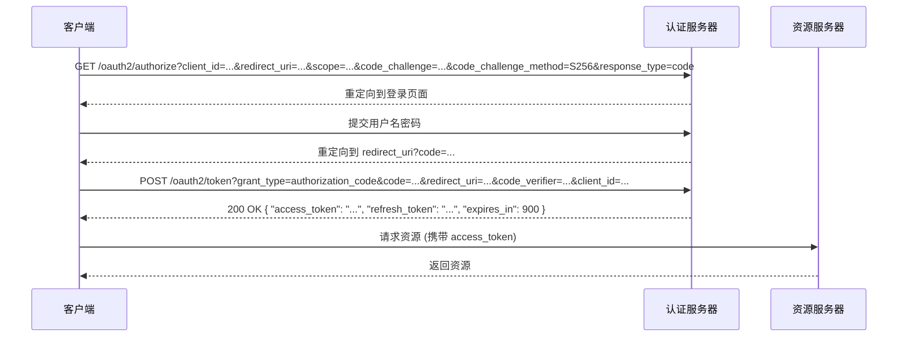
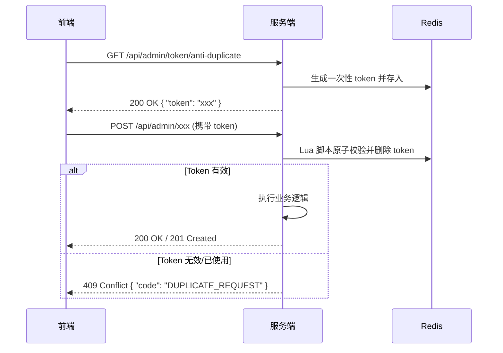

# OpusNocturne API 接口文档

本文档详细描述了 OpusNocturne 博客系统的后端 API 接口。

> **最后更新**: 2026-03-01
> **版本**: v2.5.0

## 目录

1. [通用说明](#1-通用说明)
2. [幂等 & 并发策略](#2-幂等--并发策略)
3. [认证模块 (Auth)](#3-认证模块-auth)
4. [系统用户管理 (System User)](#4-系统用户管理-system-user)
5. [文章管理 (Blog Article)](#5-文章管理-blog-article)
6. [分类与标签 (Category & Tag)](#6-分类与标签-category--tag)
7. [评论互动 (Comment)](#7-评论互动-comment)
8. [系统角色管理 (System Role)](#8-系统角色管理-system-role)
9. [系统权限管理 (System Permission)](#9-系统权限管理-system-permission)
10. [系统设置 (System Setting)](#10-系统设置-system-setting)
11. [站点统计 (Site Statistics)](#11-站点统计-site-statistics)
12. [友情链接 (Friend Link)](#12-友情链接-friend-link)
13. [多媒体管理 (Media - Admin)](#13-多媒体管理-media---admin)
14. [系统管理 (System - Admin)](#14-系统管理-system---admin)
15. [待实现接口 (Project Roadmap)](#15-待实现接口-project-roadmap)

---

## 1. 通用说明

### 基础 URL
开发环境：`http://localhost:8080`

### 认证方式
除"前台展示"类接口外，大多数管理接口需要进行 JWT 认证。
请在 HTTP 请求头中携带 Token：
```http
Authorization: Bearer <Your-Token>
```

### 安全策略系统

#### Token 有效期
- **Access-Token**: 15 分钟
- **Refresh-Token**: 7 天
- **轮换策略**: 每次刷新后旧 RT 即刻失效，新 RT 有效期重置

#### 多端登录控制
- 同一账号最多 3 个并发会话
- 超限时最早会话被踢出并返回 401 错误码
- 被踢出响应示例：
  ```json
  {
    "code": "KICKED_BY_NEW_LOGIN",
    "message": "您的账号已在其他设备登录",
    "data": null
  }
  ```

#### SSO 接入点
- **授权端点**: `/oauth2/authorize`
- **令牌端点**: `/oauth2/token`
- **支持流程**: Authorization Code + PKCE

**序列图**：

```mermaid
sequenceDiagram
    participant Client as 客户端
    participant Auth as 认证服务器
    participant Resource as 资源服务器

    Client->>Auth: GET /oauth2/authorize?client_id=...&redirect_uri=...&scope=...&code_challenge=...&code_challenge_method=S256&response_type=code
    Auth-->>Client: 重定向到登录页面
    Client->>Auth: 提交用户名密码
    Auth-->>Client: 重定向到 redirect_uri?code=...
    Client->>Auth: POST /oauth2/token?grant_type=authorization_code&code=...&redirect_uri=...&code_verifier=...&client_id=...
    Auth-->>Client: 200 OK { "access_token": "...", "refresh_token": "...", "expires_in": 900 }
    Client->>Resource: 请求资源 (携带 access_token)
    Resource-->>Client: 返回资源
```

#### 审计日志
- 所有包含敏感词接口（登录、改密、赋权）强制记录审计事件
- 文档中标注"本接口会产生审计日志"
- 审计内容包括：操作人、操作时间、操作类型、操作结果、IP地址等

### HTTP 状态码策略

| HTTP 状态码 | 含义 | 适用场景 |
|:---:|:---|:---|
| **200** | 业务成功 | 常规查询、读取操作 |
| **201** | 资源创建成功 | POST 新增操作 |
| **204** | 无内容返回 | DELETE/PUT 成功且无需 body |
| **400** | 请求参数非法 | 缺少字段、类型错误、自定义校验失败 |
| **401** | 未携带或携带无效 Token | 未登录、Token 过期、被踢出 |
| **403** | 已认证但权限不足 | 角色、菜单、数据权限不足 |
| **404** | 资源或接口不存在 | 访问的资源不存在 |
| **409** | 业务冲突 | 唯一索引、乐观锁 version 不一致 |
| **422** | 业务校验失败 | 自定义 code 枚举 |
| **429** | 接口限流触发 | 请求过于频繁 |
| **500** | 系统异常 | 未预期异常、数据库连接失败 |

### 统一响应结构
所有接口均返回统一的 JSON 格式，基于 `Result` 类设计：

**成功（200/201 - 带数据）**
```json
{
  "code": 0,
  "message": "操作成功",
  "data": { ... }
}
```

**成功（204 - 无数据）**
```json
{
  "code": 0,
  "message": "操作成功",
  "data": null
}
```

**失败（400/401/403/404/409/422/429/500）**
```json
{
  "code": 2001,
  "message": "请先登录后再操作",
  "data": null
}
```

### 错误码一览表

| 错误码 | 枚举名 | 提示信息 | 使用场景 |
|:---:|:---|:---|:---|
| **0** | SUCCESS | 操作成功 | 所有成功响应 |
| **1000** | SYSTEM_ERROR | 系统繁忙，请稍后再试 | 未预期的系统异常 |
| **1001** | PARAM_ERROR | 请求参数有误，请检查后重试 | 参数校验失败 |
| **1002** | NOT_FOUND | 您访问的内容不存在 | 404 资源不存在 |
| **1004** | METHOD_NOT_ALLOWED | 不支持该请求方式 | 405 请求方法错误 |
| **1005** | TOO_MANY_REQUESTS | 请求过于频繁，请稍后再试 | 限流拦截 |
| **1006** | DATA_ALREADY_EXISTS | 数据已存在，请勿重复操作 | 唯一约束冲突 |
| **2001** | UNAUTHORIZED | 请先登录后再操作 | 未登录或 Token 无效 |
| **2003** | FORBIDDEN | 抱歉，您没有权限执行此操作 | 权限不足 |
| **2004** | LOGIN_FAILED | 用户名或密码错误，请重新输入 | 登录失败 |
| **2005** | TOKEN_EXPIRED | 登录已过期，请重新登录 | Token 过期 |
| **2006** | TOKEN_INVALID | 登录凭证无效，请重新登录 | Token 解析失败 |
| **2007** | TOKEN_REPLACED | 您的账号已在其他设备登录... | 多端登录被顶替 |
| **3001** | USER_NOT_FOUND | 用户不存在 | 用户查询失败 |
| **3002** | USER_DISABLED | 该账号已被禁用，请联系管理员 | 账号被禁 |
| **3003** | USER_EXISTS | 该用户名已被注册 | 用户名重复 |
| **3005** | OLD_PASSWORD_ERROR | 原密码不正确，请重新输入 | 修改密码校验 |
| **4001** | ROLE_NOT_FOUND | 角色不存在 | 角色查询失败 |
| **4002** | ROLE_EXISTS | 该角色名称已存在 | 角色名重复 |
| **4003** | PERMISSION_NOT_FOUND | 权限不存在 | 权限查询失败 |
| **5001** | ARTICLE_NOT_FOUND | 文章不存在或已被删除 | 文章查询失败 |
| **5002** | CATEGORY_NOT_FOUND | 分类不存在 | 分类查询失败 |
| **5003** | TAG_NOT_FOUND | 标签不存在 | 标签查询失败 |
| **5004** | CATEGORY_EXISTS | 该分类名称已存在 | 分类名重复 |
| **5005** | TAG_EXISTS | 该标签名称已存在 | 标签名重复 |
| **5006** | CATEGORY_HAS_ARTICLES | 该分类下还有文章，无法删除 | 删除分类时存在关联文章 |
| **5007** | ARTICLE_CREATE_FAILED | 文章创建失败，请稍后再试 | 文章创建操作失败 |
| **5008** | ARTICLE_DELETE_EMPTY | 没有选择要删除的文章 | 批量删除文章时未选择文章 |
| **6001** | COMMENT_NOT_FOUND | 评论不存在或已被删除 | 评论查询失败 |
| **6003** | COMMENT_CONTENT_EMPTY | 评论内容不能为空 | 评论校验 |
| **7001** | FILE_UPLOAD_FAILED | 文件上传失败，请稍后再试 | 文件上传异常 |
| **7002** | FILE_TYPE_ERROR | 不支持该文件格式... | 文件类型校验 |
| **7003** | FILE_SIZE_EXCEEDED | 文件大小超出限制，请压缩后重试 | 文件过大 |

### 分页规则
分页查询接口通常包含以下查询参数：
- `current`: 当前页码，默认 1
- `size`: 每页条数，默认 10

分页响应数据结构：
```json
{
  "records": [ ... ],
  "total": 100,
  "size": 10,
  "current": 1,
  "pages": 10
}
```

### 时间格式约定

所有时间字段统一使用 **Jackson 全局配置** 的格式，时区为 `Asia/Shanghai`：

| 类型 | 格式 | 示例 |
|:---|:---|:---|
| 日期时间 | `yyyy-MM-dd HH:mm:ss` | `2026-02-20 10:30:00` |
| 日期 | `yyyy-MM-dd` | `2026-02-20` |

> ⚠️ **注意**：前端发送的时间参数请同样使用上述格式，避免因格式差异导致解析失败。
>
> 对应 Spring Boot 配置：
> ```yaml
> spring.jackson.date-format: yyyy-MM-dd HH:mm:ss
> spring.jackson.time-zone: Asia/Shanghai
> ```

### 空值处理约定

| 场景 | 处理方式 |
|:---|:---|
| 响应中的 `null` 字段 | 字段保留，值为 `null`。前端应做相应的空值判断 |
| 请求中的可选字段 | 不传或传 `null` 均表示不修改/不筛选 |
| 空字符串 `""` | 视为有效值（非 `null`），可能触发校验 |
| 分页默认值 | `current` 不传默认为 `1`，`size` 不传默认为 `10` |

---


## 2. 幂等 & 并发策略

### 2.1 幂等矩阵表

| HTTP Method | 天然幂等 | 说明 |
|:---:|:---:|:---|
| **GET** | ✓ | 天然幂等，多次调用返回相同结果 |
| **POST** | ✗ | 非幂等，多次调用可能创建重复资源 |
| **PUT** | ✓ | 天然幂等，多次调用最终状态一致 |
| **DELETE** | ✓ | 天然幂等，多次调用最终状态一致 |

### 2.2 非幂等 POST 接口的幂等处理

**幂等键生成规则**：
- 客户端生成唯一的 `Idempotency-Key` 头（建议使用 UUID v4）
- 服务端存储时长：24 小时
- 冲突返回：409 Conflict

**示例请求头**：
```http
POST /api/admin/article
Idempotency-Key: 550e8400-e29b-41d4-a716-446655440000
```


### 2.3 防重 Token 流程


```mermaid
sequenceDiagram
    participant Client as 前端
    participant Server as 服务端
    participant Redis as Redis

    Client->>Server: GET /api/admin/token/anti-duplicate
    Server->>Redis: 生成一次性 token 并存入
    Server-->>Client: 200 OK { "token": "xxx" }
    
    Client->>Server: POST /api/admin/xxx (携带 token)
    Server->>Redis: Lua 脚本原子校验并删除 token
    alt Token 有效
        Server->>Server: 执行业务逻辑
        Server-->>Client: 200 OK / 201 Created
    else Token 无效/已使用
        Server-->>Client: 409 Conflict { "code": "DUPLICATE_REQUEST" }
    end
```

### 2.4 并发写冲突示例

**请求**：
```http
PUT /api/admin/article/100
Content-Type: application/json

{
  "title": "Spring Boot 实战",
  "content": "...",
  "version": 1
}
```

**响应（409 Conflict）**：
```json
{
  "code": 409,
  "message": "数据版本不一致，请刷新后重试",
  "data": null
}
```

---

## 3. 认证模块 (Auth)

### 3.1 用户登录

- **接口路径**: `POST /api/admin/auth/login`
- **是否认证**: 否
- **HTTP 状态码**: 200 (成功), 401 (认证失败), 429 (限流)
- **审计日志**: 本接口会产生审计日志

**请求体 (JSON)**

| 字段名 | 类型 | 必填 | 说明 | 示例 |
|:---|:---|:---|:---|:---|
| username | string | 是 | 用户名 | `admin` |
| password | string | 是 | 密码 | `admin123` |

**前端调用示例**
```javascript
axios.post('/api/admin/auth/login', {
  username: 'admin',
  password: 'admin123'
}).then(response => {
  const token = response.data.data.token;
  localStorage.setItem('token', token);
});
```

**成功响应（200）**
```json
{
  "code": 0,
  "message": "操作成功",
  "data": {
    "token": "eyJhbGciOiJIUzI1NiJ9...",
    "tokenHead": "Bearer "
  }
}
```

**错误响应（401）**
```json
{
  "code": 2004,
  "message": "用户名或密码错误，请重新输入",
  "data": null
}
```

**错误响应（429）**
```json
{
  "code": 1005,
  "message": "请求过于频繁，请稍后再试",
  "data": null
}
```

---

### 3.2 退出登录

- **接口路径**: `POST /api/admin/auth/logout`
- **是否认证**: 是
- **HTTP 状态码**: 204 (成功), 401 (认证失败)

**成功响应（204）**
```json
{
  "code": 0,
  "message": "操作成功",
  "data": null
}
```

**错误响应（401）**
```json
{
  "code": 2001,
  "message": "请先登录后再操作",
  "data": null
}
```

---

### 3.3 获取当前用户信息

- **接口路径**: `GET /api/admin/auth/info`
- **是否认证**: 是
- **HTTP 状态码**: 200 (成功), 401 (认证失败)

**成功响应（200）**
```json
{
  "code": 0,
  "message": "操作成功",
  "data": {
    "id": 1,
    "username": "admin",
    "nickname": "超级管理员",
    "avatar": "...",
    "email": "...",
    "status": 1,
    "roleIds": [1],
    "createTime": "2026-01-01 12:00:00",
    "permissions": ["article:create", "article:update"]
  }
}
```

**错误响应（401）**
```json
{
  "code": 2001,
  "message": "请先登录后再操作",
  "data": null
}
```

---

### 3.4 刷新 Token

- **接口路径**: `POST /api/admin/auth/refresh`
- **是否认证**: 是
- **HTTP 状态码**: 200 (成功), 401 (认证失败)

**成功响应（200）**
```json
{
  "code": 0,
  "message": "操作成功",
  "data": {
    "token": "eyJhbGciOiJIUzI1NiJ9...",
    "tokenHead": "Bearer "
  }
}
```

**错误响应（401）**
```json
{
  "code": 2005,
  "message": "登录已过期，请重新登录",
  "data": null
}
```

---

### 3.5 修改密码

- **接口路径**: `PUT /api/admin/auth/change-password`
- **是否认证**: 是
- **HTTP 状态码**: 200 (成功), 400 (参数校验失败), 401 (认证失败), 422 (业务校验失败)
- **审计日志**: 本接口会产生审计日志

**请求体 (JSON)**

| 字段名 | 类型 | 必填 | 说明 | 校验规则 |
|:---|:---|:---|:---|:---|
| oldPassword | string | 是 | 旧密码 | 不能为空 |
| newPassword | string | 是 | 新密码 | 不能为空，长度 6-20 位 |
| confirmPassword | string | 是 | 确认新密码 | 不能为空，需与 newPassword 一致 |

**前端调用示例**
```javascript
axios.put('/api/admin/auth/change-password', {
  oldPassword: 'oldPass123',
  newPassword: 'newPass456',
  confirmPassword: 'newPass456'
});
```

**成功响应（200）**
```json
{
  "code": 0,
  "message": "密码修改成功，请重新登录",
  "data": null
}
```

> ⚠️ **注意**：密码修改成功后，服务端会自动注销当前用户的 Token，前端需引导用户重新登录。

**错误响应 — 两次密码不一致（422）**
```json
{
  "code": 3004,
  "message": "两次输入的密码不一致",
  "data": null
}
```

**错误响应 — 旧密码错误（422）**
```json
{
  "code": 3005,
  "message": "原密码不正确，请重新输入",
  "data": null
}
```

**错误响应 — 用户不存在（404）**
```json
{
  "code": 3001,
  "message": "用户不存在",
  "data": null
}
```

**错误响应 — 参数校验失败（400）**
```json
{
  "code": 1001,
  "message": "密码长度必须在6-20位之间",
  "data": null
}
```

---

## 4. 系统用户管理 (System User)

### 4.1 分页获取用户列表

- **接口路径**: `GET /api/admin/user/page`
- **是否认证**: 是

**查询参数**

| 名称 | 类型 | 必填 | 示例 | 说明 |
|:---|:---|:---|:---|:---|
| current | int | 否 | `1` | 页码 |
| size | int | 否 | `10` | 每页条数 |
| username | string | 否 | `admin` | 用户名搜索 |
| nickname | string | 否 | `管理员` | 昵称搜索 |

**成功响应**
```json
{
  "code": 0,
  "message": "操作成功",
  "data": {
    "records": [
      {
        "id": 1,
        "username": "admin",
        "nickname": "超级管理员",
        "avatar": "http://...",
        "email": "admin@example.com",
        "status": 1,
        "createTime": "2026-01-01 12:00:00"
      }
    ],
    "total": 1,
    "size": 10,
    "current": 1,
    "pages": 1
  }
}
```

---

### 4.2 创建用户

- **接口路径**: `POST /api/admin/user`
- **是否认证**: 是

**请求体 (JSON)**

| 字段名 | 类型 | 必填 | 说明 |
|:---|:---|:---|:---|
| username | string | 是 | 用户名，不可重复 |
| password | string | 是 | 初始密码 |
| nickname | string | 否 | 昵称 |
| email | string | 否 | 邮箱 |
| roleIds | array | 否 | 关联角色ID列表，如 `[1, 2]` |
| status | int | 否 | 状态：1-启用，0-禁用 (默认1) |

**成功响应**
```json
{
  "code": 0,
  "message": "操作成功",
  "data": null
}
```

**失败响应**
```json
{
  "code": 3003,
  "message": "该用户名已被注册",
  "data": null
}
```

---

### 4.3 更新用户

- **接口路径**: `PUT /api/admin/user/{id}`
- **是否认证**: 是

**路径参数**

| 名称 | 示例 | 说明 |
|:---|:---|:---|
| id | `1` | 用户ID |

**请求体 (JSON)**

| 字段名 | 类型 | 必填 | 说明 |
|:---|:---|:---|:---|
| nickname | string | 否 | 昵称 |
| email | string | 否 | 邮箱 |
| roleIds | array | 否 | 关联角色ID列表 |
| status | int | 否 | 状态：1-启用，0-禁用 |

**成功响应**
```json
{
  "code": 0,
  "message": "操作成功",
  "data": null
}
```

**失败响应**
```json
{
  "code": 3001,
  "message": "用户不存在",
  "data": null
}
```

---

### 4.4 删除用户

- **接口路径**: `DELETE /api/admin/user/{id}`
- **是否认证**: 是

**路径参数**

| 名称 | 示例 | 说明 |
|:---|:---|:---|
| id | `1` | 用户ID |

**成功响应**
```json
{
  "code": 0,
  "message": "操作成功",
  "data": null
}
```

---

### 4.5 获取用户详情

- **接口路径**: `GET /api/admin/user/{id}`
- **是否认证**: 是

**路径参数**

| 名称 | 示例 | 说明 |
|:---|:---|:---|
| id | `1` | 用户ID |

**成功响应**
```json
{
  "code": 0,
  "message": "操作成功",
  "data": {
    "id": 1,
    "username": "admin",
    "nickname": "超级管理员",
    "avatar": "http://...",
    "email": "admin@example.com",
    "status": 1,
    "roleIds": [1],
    "createTime": "2026-01-01 12:00:00"
  }
}
```

---

### 4.6 重置用户密码

- **接口路径**: `PUT /api/admin/user/{id}/reset-password`
- **是否认证**: 是

**路径参数**

| 名称 | 示例 | 说明 |
|:---|:---|:---|
| id | `1` | 用户ID |

**请求体 (JSON)**

| 字段名 | 类型 | 必填 | 说明 |
|:---|:---|:---|:---|
| password | string | 是 | 新密码 |

**成功响应**
```json
{
  "code": 0,
  "message": "操作成功",
  "data": null
}
```

**失败响应**
```json
{
  "code": 3001,
  "message": "用户不存在",
  "data": null
}
```

---

## 5. 文章管理 (Blog Article)

### 5.1 创建文章

- **接口路径**: `POST /api/admin/article`
- **是否认证**: 是

**请求体 (JSON)**

| 字段名 | 类型 | 必填 | 说明 |
|:---|:---|:---|:---|
| title | string | 是 | 文章标题 |
| content | string | 是 | 文章内容 (Markdown格式) |
| summary | string | 否 | 摘要 |
| categoryId | long | 是 | 分类ID |
| tagIds | array | 否 | 标签ID列表，如 `[1, 3]` |
| coverImg | string | 否 | 封面图片URL |
| isTop | int | 否 | 是否置顶：1-是，0-否 |
| status | int | 是 | 状态：0-草稿，1-发布，2-下架 |
| slug | string | 否 | URL别名(SEO)，如 `spring-boot-3-practice`。**如果不填写，系统会根据标题自动生成** |
| keywords | string | 否 | SEO关键词，多个关键词用逗号分隔，如 `Spring Boot,Java`。**- 由作者完全手动填写，系统不会自动生成，多个关键词用逗号分隔，如 Spring Boot,Java,JDK21** |

**Markdown图片处理说明**
- 文章中的图片需要先通过 `/api/admin/attachment/upload` 接口上传
- 上传成功后获取返回的图片URL
- 将获取到的URL插入到Markdown内容中，格式为 ``
- 直接复制粘贴的图片不会自动上传，需要手动处理

**标签关联说明**
- 通过 `tagIds` 参数管理 `article_tag` 关联关系
- 创建时根据 `tagIds` 生成关联记录
- 更新时会先删除旧关联再重建

**前端调用示例**
```javascript
axios.post('/api/admin/article', {
  title: 'Spring Boot 实战',
  content: '# Hello World\n...',
  categoryId: 1,
  tagIds: [101, 102],
  status: 1
});
```

**成功响应**
```json
{
  "code": 0,
  "message": "操作成功",
  "data": {
    "id": 100,
    "title": "Spring Boot 实战"
  }
}
```

**失败响应**
```json
{
  "code": 1001,
  "message": "标题不能为空",
  "data": null
}
```

---

### 5.2 后台文章列表

- **接口路径**: `GET /api/admin/article/page`
- **是否认证**: 是

**查询参数**

| 名称 | 类型 | 必填 | 示例 | 说明 |
|:---|:---|:---|:---|:---|
| current | int | 否 | `1` | 页码 |
| size | int | 否 | `10` | 每页条数 |
| title | string | 否 | `Spring` | 文章标题搜索 |
| categoryId | long | 否 | `1` | 按分类筛选 |
| status | int | 否 | `1` | 按状态筛选 |

**成功响应**
```json
{
  "code": 0,
  "message": "操作成功",
  "data": {
    "records": [
      {
        "id": 100,
        "title": "Spring Boot 实战",
        "summary": "本文介绍...",
        "coverImg": "http://...",
        "viewCount": 120,
        "isTop": 0,
        "status": 1,
        "categoryName": "后端技术",
        "authorNickname": "Admin",
        "publishTime": "2026-02-01 10:00:00",
        "createTime": "2026-01-30 16:00:00"
      }
    ],
    "total": 10,
    "size": 10,
    "current": 1,
    "pages": 1
  }
}
```

---

### 5.3 更新文章

- **接口路径**: `PUT /api/admin/article/{id}`
- **是否认证**: 是

**路径参数**

| 名称 | 示例 | 说明 |
|:---|:---|:---|
| id | `100` | 文章ID |

**请求体 (JSON)**

| 字段名 | 类型 | 必填 | 说明 |
|:---|:---|:---|:---|
| title | string | 是 | 文章标题 |
| content | string | 是 | 文章内容 (Markdown格式) |
| summary | string | 否 | 摘要 |
| categoryId | long | 是 | 分类ID |
| tagIds | array | 否 | 标签ID列表 |
| coverImg | string | 否 | 封面图片URL |
| isTop | int | 否 | 是否置顶 |
| status | int | 是 | 状态：0-草稿，1-发布，2-下架 |
| slug | string | 否 | URL别名(SEO)，如 `spring-boot-3-practice`。**如果不填写，系统会根据标题自动生成** |
| keywords | string | 否 | SEO关键词，多个关键词用逗号分隔，如 `Spring Boot,Java`。**由作者手动填写，用于SEO优化** |

**Markdown图片处理说明**
- 文章中的图片需要先通过 `/api/admin/attachment/upload` 接口上传
- 上传成功后获取返回的图片URL
- 将获取到的URL插入到Markdown内容中，格式为 ``
- 直接复制粘贴的图片不会自动上传，需要手动处理

**成功响应**
```json
{
  "code": 0,
  "message": "操作成功",
  "data": null
}
```

**失败响应**
```json
{
  "code": 5001,
  "message": "文章不存在或已被删除",
  "data": null
}
```

---

### 5.4 删除文章

- **接口路径**: `DELETE /api/admin/article/{id}`
- **是否认证**: 是

**路径参数**

| 名称 | 示例 | 说明 |
|:---|:---|:---|
| id | `100` | 文章ID |

**成功响应**
```json
{
  "code": 0,
  "message": "操作成功",
  "data": null
}
```

---

### 5.5 批量删除文章

- **接口路径**: `DELETE /api/admin/article/batch-delete`
- **是否认证**: 是
- **审计日志**: 本接口会产生审计日志

**请求体 (JSON)**
直接传递待删除的文章 ID 数组。

| 字段名 | 类型  | 必填 | 说明         |
| ------ | ----- | ---- | ------------ |
| -      | array | 是   | 文章ID列表，如 `[100, 101, 102]` |

**前端调用示例**
```javascript
axios.delete('/api/admin/article/batch-delete', {
  data: [100, 101, 102] // 注意：在 DELETE 请求中，数组需放在 data 属性里
}).then(response => {
  console.log('批量删除成功');
});
```

**成功响应 (204)**
```json
{
  "code": 0,
  "message": "操作成功",
  "data": null
}
```

**失败响应**
- **未选择文章**
```json
{
  "code": 1001,
  "message": "请选择要删除的文章",
  "data": null
}
```
- **部分文章不存在或已被删除**
```json
{
  "code": 5001,
  "message": "文章【100, 102】不存在或已被删除",
  "data": null
}
```

---

### 5.6 文章详情 (后台)

- **接口路径**: `GET /api/admin/article/{id}`
- **是否认证**: 是

**路径参数**

| 名称 | 示例 | 说明 |
|:---|:---|:---|
| id | `100` | 文章ID |

**成功响应**
```json
{
  "code": 0,
  "message": "操作成功",
  "data": {
    "id": 100,
    "title": "Spring Boot 实战",
    "content": "# 详细内容...",
    "summary": "本文介绍...",
    "categoryId": 1,
    "categoryName": "后端技术",
    "tagIds": [1, 2, 3],
    "tags": [
      { "id": 1, "name": "Java" },
      { "id": 2, "name": "Spring Boot" }
    ],
    "coverImg": "http://...",
    "isTop": 0,
    "status": 1,
    "publishTime": "2026-02-01 10:00:00",
    "createTime": "2026-01-30 16:00:00",
    "updateTime": "2026-02-01 10:00:00"
  }
}
```

---

### 5.7 文章置顶/取消置顶

- **接口路径**: `PUT /api/admin/article/{id}/top`
- **是否认证**: 是

**路径参数**

| 名称 | 示例 | 说明 |
|:---|:---|:---|
| id | `100` | 文章ID |

**请求体 (JSON)**

| 字段名 | 类型 | 必填 | 说明 |
|:---|:---|:---|:---|
| isTop | int | 是 | 是否置顶：1-是，0-否 |

**成功响应**
```json
{
  "code": 0,
  "message": "操作成功",
  "data": null
}
```

---

### 5.8 更新文章状态

- **接口路径**: `PUT /api/admin/article/{id}/status`
- **是否认证**: 是

**路径参数**

| 名称 | 示例 | 说明 |
|:---|:---|:---|
| id | `100` | 文章ID |

**请求体 (JSON)**

| 字段名 | 类型 | 必填 | 说明 |
|:---|:---|:---|:---|
| status | int | 是 | 状态：0-草稿，1-发布，2-下架 |

**成功响应**
```json
{
  "code": 0,
  "message": "操作成功",
  "data": null
}
```

---

### 5.9 前台文章列表 (Portal)

- **接口路径**: `GET /api/blog/article/page`
- **是否认证**: 否

**查询参数**

| 名称 | 类型 | 必填 | 示例 | 说明 |
|:---|:---|:---|:---|:---|
| current | int | 否 | `1` | 页码 |
| size | int | 否 | `10` | 每页条数 |
| categoryId | long | 否 | `1` | 按分类筛选 |
| tagId | long | 否 | `5` | 按标签筛选 |

**成功响应**
```json
{
  "code": 0,
  "message": "操作成功",
  "data": {
    "records": [
      {
        "id": 100,
        "title": "Spring Boot 实战",
        "summary": "本文介绍...",
        "coverImg": "http://...",
        "viewCount": 120,
        "likeCount": 50,
        "publishTime": "2026-02-01 10:00:00",
        "categoryName": "后端技术",
        "tags": [
           { "id": 1, "name": "Java" }
        ]
      }
    ],
    "total": 10,
    "size": 10,
    "current": 1,
    "pages": 1
  }
}
```

---

### 5.10 前台文章详情 (Portal)

- **接口路径**: `GET /api/blog/article/{id}`
- **是否认证**: 否

**路径参数**

| 名称 | 示例 | 说明 |
|:---|:---|:---|
| id | `100` | 文章ID |

**成功响应**
```json
{
  "code": 0,
  "message": "操作成功",
  "data": {
    "id": 100,
    "title": "Spring Boot 实战",
    "content": "# 详细内容...",
    "summary": "本文介绍...",
    "coverImg": "http://...",
    "viewCount": 121,
    "likeCount": 50,
    "publishTime": "2026-02-01 10:00:00",
    "categoryId": 1,
    "categoryName": "后端技术",
    "authorNickname": "Admin",
    "tags": [ ... ],
    "prevArticle": { "id": 99, "title": "上一篇" },
    "nextArticle": { "id": 101, "title": "下一篇" }
  }
}
```

**失败响应**
```json
{
  "code": 5001,
  "message": "文章不存在或已被删除",
  "data": null
}
```

### 5.11 获取文章归档 (Portal)

- **接口路径**: `GET /api/blog/article/archive`
- **是否认证**: 否
- **功能说明**: 将文章按照“年份-月份”进行分组展示，用于归档页面。

**成功响应**
```json
{
  "code": 0,
  "message": "操作成功",
  "data": [
    {
      "year": "2023",
      "months": [
        {
          "month": "10",
          "count": 5,
          "articles": [
            {
              "id": 1,
              "title": "Spring Boot 3 实战",
              "createTime": "2023-10-01 12:00:00",
              "day": "01"
            }
          ]
        }
      ]
    }
  ]
}
```

### 5.12 文章点赞/取消点赞 (Portal)

- **接口路径**: `POST /api/blog/article/{id}/like`
- **是否认证**: 否（通过 IP 限制重复点赞）

**路径参数**

| 名称 | 示例 | 说明 |
|:---|:---|:---|
| id | `1` | 文章ID |

**功能说明**：
- 首次点击：执行点赞操作，返回最新点赞数
- 再次点击：执行取消点赞操作，返回最新点赞数
- 系统会通过 IP 地址识别用户，防止重复点赞

**成功响应**
```json
{
  "code": 0,
  "message": "操作成功",
  "data": 122  // 返回最新的点赞数
}
```

---

## 6. 分类与标签 (Category & Tag)

### 6.1 获取全部分类 (Portal)

- **接口路径**: `GET /api/blog/category/list`
- **是否认证**: 否

**成功响应**
```json
{
  "code": 0,
  "message": "操作成功",
  "data": [
    {
      "id": 1,
      "name": "Java",
      "articleCount": 15
    },
    {
      "id": 2,
      "name": "随笔",
      "articleCount": 3
    }
  ]
}
```

---

### 6.2 后台分类管理接口

#### 6.2.1 分页获取分类列表

- **接口路径**: `GET /api/admin/category/list`
- **是否认证**: 是

**查询参数**

| 名称 | 类型 | 必填 | 示例 | 说明 |
|:---|:---|:---|:---|:---|
| current | int | 否 | `1` | 页码 |
| size | int | 否 | `10` | 每页条数 |
| name | string | 否 | `Java` | 分类名称搜索 |

**成功响应**
```json
{
  "code": 0,
  "message": "操作成功",
  "data": {
    "records": [
      {
        "id": 1,
        "name": "Java",
        "description": "Java相关技术",
        "sort": 0,
        "status": 1,
        "createTime": "2026-01-01 12:00:00",
        "updateTime": "2026-01-01 12:00:00"
      }
    ],
    "total": 1,
    "size": 10,
    "current": 1,
    "pages": 1
  }
}
```

#### 6.2.2 创建分类

- **接口路径**: `POST /api/admin/category`
- **是否认证**: 是

**请求体 (JSON)**

| 字段名 | 类型 | 必填 | 说明 |
|:---|:---|:---|:---|
| name | string | 是 | 分类名称 |
| description | string | 否 | 描述 |
| sort | int | 否 | 排序（升序） |
| status | int | 否 | 状态：1-启用，0-禁用 (默认1) |

**成功响应**
```json
{
  "code": 0,
  "message": "操作成功",
  "data": null
}
```

**失败响应**
```json
{
  "code": 5004,
  "message": "该分类名称已存在",
  "data": null
}
```

#### 6.2.3 更新分类

- **接口路径**: `PUT /api/admin/category/{id}`
- **是否认证**: 是

**路径参数**

| 名称 | 示例 | 说明 |
|:---|:---|:---|
| id | `1` | 分类ID |

**请求体 (JSON)**

| 字段名 | 类型 | 必填 | 说明 |
|:---|:---|:---|:---|
| name | string | 是 | 分类名称 |
| description | string | 否 | 描述 |
| sort | int | 否 | 排序（升序） |
| status | int | 否 | 状态：1-启用，0-禁用 |

**成功响应**
```json
{
  "code": 0,
  "message": "操作成功",
  "data": null
}
```

**失败响应**
```json
{
  "code": 5002,
  "message": "分类不存在",
  "data": null
}
```

#### 6.2.4 删除分类

- **接口路径**: `DELETE /api/admin/category/{id}`
- **是否认证**: 是

**路径参数**

| 名称 | 示例 | 说明 |
|:---|:---|:---|
| id | `1` | 分类ID |

**成功响应**
```json
{
  "code": 0,
  "message": "操作成功",
  "data": null
}
```

**失败响应**
```json
{
  "code": 5006,
  "message": "该分类下还有文章，无法删除",
  "data": null
}
```

#### 6.2.5 批量删除分类

- **接口路径**: `DELETE /api/admin/category/batch-delete`
- **是否认证**: 是

**请求体 (JSON)**

直接传递 ID 数组：
```json
[1, 2, 3]
```

**成功响应**
```json
{
  "code": 0,
  "message": "操作成功",
  "data": null
}
```

**失败响应**
```json
{
  "code": 5006,
  "message": "分类【Java】下存在文章，无法删除",
  "data": null
}
```

---

### 6.3 标签管理接口

#### 6.3.1 获取所有标签 (Portal)

- **接口路径**: `GET /api/blog/tag/list`
- **是否认证**: 否

**成功响应**
```json
{
  "code": 0,
  "message": "操作成功",
  "data": [
    {
      "id": 1,
      "name": "Spring Boot",
      "color": "#1890ff",
      "articleCount": 10
    }
  ]
}
```

#### 6.3.2 分页获取标签列表 (后台)

- **接口路径**: `GET /api/admin/tag/list`
- **是否认证**: 是

**查询参数**

| 名称 | 类型 | 必填 | 示例 | 说明 |
|:---|:---|:---|:---|:---|
| current | int | 否 | `1` | 页码 |
| size | int | 否 | `10` | 每页条数 |
| name | string | 否 | `Spring` | 标签名称搜索 |

#### 6.3.3 创建标签

- **接口路径**: `POST /api/admin/tag`
- **是否认证**: 是

**请求体 (JSON)**

| 字段名 | 类型 | 必填 | 说明 |
|:---|:---|:---|:---|
| name | string | 是 | 标签名称 |
| color | string | 否 | 标签颜色，默认 `#1890ff` |

**成功响应**
```json
{
  "code": 0,
  "message": "操作成功",
  "data": null
}
```

**失败响应**
```json
{
  "code": 5005,
  "message": "该标签名称已存在",
  "data": null
}
```

#### 6.3.4 更新标签

- **接口路径**: `PUT /api/admin/tag/{id}`
- **是否认证**: 是

**路径参数**

| 名称 | 示例 | 说明 |
|:---|:---|:---|
| id | `1` | 标签ID |

**请求体 (JSON)**

| 字段名 | 类型 | 必填 | 说明 |
|:---|:---|:---|:---|
| name | string | 是 | 标签名称 |
| color | string | 否 | 标签颜色 |

**成功响应**
```json
{
  "code": 0,
  "message": "操作成功",
  "data": null
}
```

**失败响应**
```json
{
  "code": 5003,
  "message": "标签不存在",
  "data": null
}
```

#### 6.3.5 删除标签

- **接口路径**: `DELETE /api/admin/tag/{id}`
- **是否认证**: 是

**路径参数**

| 名称 | 示例 | 说明 |
|:---|:---|:---|
| id | `1` | 标签ID |

**成功响应**
```json
{
  "code": 0,
  "message": "操作成功",
  "data": null
}
```

#### 6.3.6 批量删除标签

- **接口路径**: `DELETE /api/admin/tag/batch-delete`
- **是否认证**: 是

**请求体 (JSON)**

直接传递 ID 数组：
```json
[1, 2, 3]
```

**成功响应**
```json
{
  "code": 0,
  "message": "操作成功",
  "data": null
}
```

---

## 7. 评论互动 (Comment)

### 7.1 分页获取文章评论树 (Portal)

- **接口路径**: `GET /api/blog/comment/tree/{articleId}`
- **是否认证**: 否

> 💡 **优化说明（两级分页策略）**：
> 为避免热门文章评论量过大时的 OOM 风险，接口已从"全量返回"改为"分页返回"。
> - **外层分页**：先查当前页的顶级评论（`rootParentId IS NULL`）。
> - **内层批量查**：通过 `IN(rootIds)` 一次查出这些顶级评论下的所有子评论并组装到树中。

**路径参数**

| 名称 | 示例 | 说明 |
|:---|:---|:---|
| articleId | `100` | 文章ID。若为 `0` 则获取留言板评论 |

**查询参数**

| 名称 | 类型 | 必填 | 默认值 | 说明 |
|:---|:---|:---|:---|:---|
| current | int | 否 | `1` | 当前页码，从 1 开始 |
| size | int | 否 | `10` | 每页顶级评论条数 |

**成功响应**
```json
{
  "code": 0,
  "message": "操作成功",
  "data": {
    "total": 128,
    "list": [
      {
        "id": 501,
        "nickname": "用户A",
        "content": "写的真好！",
        "createTime": "2026-02-17 10:00:00",
        "replyNickname": null,
        "childCount": 5,
        "children": []
      }
    ]
  }
}
```

**响应字段说明**

| 字段 | 类型 | 说明 |
|:---|:---|:---|
| total | long | 顶级评论总数，用于前端计算总页数 |
| list | array | 当前页的顶级评论列表，每条内部嵌套其子评论 |
| list[].id | long | 评论ID（仅用于前端技术处理，不建议在界面上展示） |
| list[].nickname | string | 评论人昵称 |
| list[].content | string | 评论内容 |
| list[].createTime | string | 发表时间 |
| list[].replyNickname | string | 被回复人昵称（顶级评论为 `null`） |
| list[].childCount | integer | 子评论总数 |
| list[].children | array | 子评论列表（初始为空，需要通过分页接口加载） |


### 7.2 获取文章评论统计 (Portal)

- **接口路径**: `GET /api/blog/comment/stats/{articleId}`
- **是否认证**: 否

**路径参数**

| 名称 | 示例 | 说明 |
|:---|:---|:---|
| articleId | `1` | 文章ID。若为 `0` 则获取留言板的评论统计 |

**成功响应**
```json
{
  "code": 0,
  "message": "操作成功",
  "data": {
    "total": 15
  }
}
```

**响应字段说明**

| 字段 | 类型 | 说明 |
|:---|:---|:---|
| total | long | 该文章的评论总数（审核通过的），包括所有父评论和子评论 |

### 7.3 分页获取子评论 (Portal)

- **接口路径**: `GET /api/blog/comment/child/{rootParentId}`
- **是否认证**: 否

> 💡 **分页策略**：
> - 第一次加载：默认显示 3 条子评论
> - 后续加载：每次点击加载 10 条子评论

**路径参数**

| 名称 | 示例 | 说明 |
|:---|:---|:---|
| rootParentId | `501` | 顶级评论ID |

**查询参数**

| 名称 | 类型 | 必填 | 默认值 | 说明 |
|:---|:---|:---|:---|:---|
| articleId | long | 是 | - | 文章ID |
| current | int | 否 | `1` | 当前页码，从 1 开始 |
| size | int | 否 | `3` | 每页条数（第一次3条，后续10条） |

**成功响应**
```json
{
  "code": 0,
  "message": "操作成功",
  "data": [
    {
      "id": 502,
      "nickname": "作者",
      "replyNickname": "用户A",
      "content": "谢谢支持",
      "createTime": "2026-02-17 10:30:00",
      "children": []
    }
  ]
}
```

**响应字段说明**

| 字段 | 类型 | 说明 |
|:---|:---|:---|
| id | long | 评论ID（仅用于前端技术处理，不建议在界面上展示） |
| nickname | string | 评论人昵称 |
| content | string | 评论内容 |
| createTime | string | 发表时间 |
| replyNickname | string | 被回复人昵称 |
| children | array | 子评论列表（始终为空，因为子评论已平铺） |

### 7.4 发表评论 / 留言 (Portal)


- **接口路径**: `POST /api/blog/comment`
- **是否认证**: 否（游客可评论）

> 💡 **树洞/留言板说明**：
> 当 `articleId` 传 `0` 或 `null` 时，该条内容将被视为**站点留言（树洞）**。
>
> **审核机制**：
> 系统会根据 `系统设置` 中的 `commentAudit` 配置决定评论是否需要审核：
> - **开启审核**（`commentAudit: true`）：评论状态默认为 `0`（待审核），需后台管理员批准后才会在前台显示。
> - **关闭审核**（`commentAudit: false`）：评论状态默认为 `1`（审核通过），提交后直接在前台显示。
>
> **审核状态说明**：
> - `0`：待审核 - 等待管理员处理
> - `1`：审核通过 - 已在前台显示
> - `2`：审核未通过 - 被管理员拒绝，不会显示

**请求体 (JSON)**

| 字段名 | 类型 | 必填 | 说明 |
|:---|:---|:---|:---|
| articleId | long | 否 | 文章ID。**传 `0` 代表留言板/树洞** |
| content | string | 是 | 评论内容 |
| parentId | long | 否 | 父评论ID，回复时必填 |
| nickname | string | 是 | 昵称 |
| email | string | 否 | 邮箱（用于接收回复通知） |

**说明**：`user_agent` 字段无需前端传递，后端将自动从请求头中提取并保存用户设备信息。

**成功响应**
```json
{
  "code": 0,
  "message": "操作成功",
  "data": null
}
```

---

### 7.5 后台评论管理

> **审核流程说明**：
> 1. **评论提交**：用户提交评论后，系统根据 `commentAudit` 配置自动设置初始状态
> 2. **后台审核**：管理员在后台查看待审核评论，进行审核操作
> 3. **状态更新**：审核通过或拒绝后，评论状态更新，前台根据状态显示或隐藏评论
> 4. **批量操作**：支持批量审核和删除评论，提高管理效率

#### 7.5.1 分页获取评论列表

- **接口路径**: `GET /api/admin/comment/page`
- **是否认证**: 是

**查询参数**

| 名称 | 类型 | 必填 | 示例 | 说明 |
|:---|:---|:---|:---|:---|
| current | int | 否 | `1` | 页码 |
| size | int | 否 | `10` | 每页条数 |
| articleId | long | 否 | `100` | 按文章ID筛选 |
| status | int | 否 | `0` | 按状态筛选：0-待审核，1-审核通过，2-审核未通过 |
| nickname | string | 否 | `用户` | 按昵称搜索 |

**成功响应**
```json
{
  "code": 0,
  "message": "操作成功",
  "data": {
    "records": [
      {
        "id": 501,
        "articleId": 100,
        "articleTitle": "Spring Boot 实战",
        "nickname": "用户A",
        "email": "user@example.com",
        "content": "写的真好！",
        "status": 1,
        "ipAddress": "127.0.0.1",
        "createTime": "2026-02-01 10:00:00"
      }
    ],
    "total": 10,
    "size": 10,
    "current": 1,
    "pages": 1
  }
}
```

#### 7.5.2 审核评论

- **接口路径**: `PUT /api/admin/comment/{id}/audit`
- **是否认证**: 是

**路径参数**

| 名称 | 示例 | 说明 |
|:---|:---|:---|
| id | `501` | 评论ID |

**请求体 (JSON)**

| 字段名 | 类型 | 必填 | 说明 |
|:---|:---|:---|:---|
| status | int | 是 | 审核状态：1-审核通过，2-审核未通过 |

**成功响应**
```json
{
  "code": 0,
  "message": "操作成功",
  "data": null
}
```

**失败响应**
```json
{
  "code": 6001,
  "message": "评论不存在或已被删除",
  "data": null
}
```

#### 7.5.3 删除评论

- **接口路径**: `DELETE /api/admin/comment/{id}`
- **是否认证**: 是

**路径参数**

| 名称 | 示例 | 说明 |
|:---|:---|:---|
| id | `501` | 评论ID |

**成功响应**
```json
{
  "code": 0,
  "message": "操作成功",
  "data": null
}
```

#### 7.5.4 批量审核评论

- **接口路径**: `PUT /api/admin/comment/batch-audit`
- **是否认证**: 是

**请求体 (JSON)**

| 字段名 | 类型 | 必填 | 说明 |
|:---|:---|:---|:---|
| ids | array | 是 | 评论ID列表，如 `[501, 502]` |
| status | int | 是 | 审核状态：1-审核通过，2-审核未通过 |

**前端调用示例**
```javascript
axios.put('/api/admin/comment/batch-audit', {
  ids: [501, 502, 503],
  status: 1
});
```

**成功响应**
```json
{
  "code": 0,
  "message": "操作成功",
  "data": null
}
```

**失败响应**
```json
{
  "code": 1001,
  "message": "请选择要审核的评论",
  "data": null
}
```

#### 7.5.5 批量删除评论

- **接口路径**: `DELETE /api/admin/comment/batch-delete`
- **是否认证**: 是

**请求体 (JSON)**

直接传递 ID 数组：
```json
[501, 502, 503]
```

**成功响应**
```json
{
  "code": 0,
  "message": "操作成功",
  "data": null
}
```

**失败响应**
```json
{
  "code": 1001,
  "message": "请选择要删除的评论",
  "data": null
}
```

---

## 8. 系统角色管理 (System Role)

### 8.1 获取所有角色

- **接口路径**: `GET /api/admin/role/list`
- **是否认证**: 是

> ⚠️ **注意**：返回全量角色列表（`List`），非分页。

**成功响应**
```json
{
  "code": 0,
  "message": "操作成功",
  "data": [
    {
      "id": 1,
      "roleName": "超级管理员",
      "roleCode": "super_admin",
      "description": "拥有系统全部权限",
      "status": 1,
      "createTime": "2026-01-01 12:00:00"
    },
    {
      "id": 2,
      "roleName": "编辑",
      "roleCode": "editor",
      "description": "文章编辑权限",
      "status": 1,
      "createTime": "2026-01-01 12:00:00"
    }
  ]
}
```

---

### 8.2 获取角色详情

- **接口路径**: `GET /api/admin/role/{id}`
- **是否认证**: 是

**路径参数**

| 名称 | 示例 | 说明 |
|:---|:---|:---|
| id | `1` | 角色ID |

**成功响应**
```json
{
  "code": 0,
  "message": "操作成功",
  "data": {
    "id": 1,
    "roleName": "超级管理员",
    "roleCode": "super_admin",
    "description": "拥有系统全部权限",
    "status": 1,
    "createTime": "2026-01-01 12:00:00",
    "updateTime": "2026-01-01 12:00:00"
  }
}
```

---

### 8.3 创建角色

- **接口路径**: `POST /api/admin/role`
- **是否认证**: 是

**请求体 (JSON)**

| 字段名 | 类型 | 必填 | 说明 |
|:---|:---|:---|:---|
| roleName | string | 是 | 角色名称，不可重复 |
| roleCode | string | 是 | 角色编码，不可重复 |
| description | string | 否 | 描述 |
| status | int | 否 | 状态：1-启用，0-禁用 (默认1) |

**成功响应**
```json
{
  "code": 0,
  "message": "操作成功",
  "data": null
}
```

---

### 8.4 更新角色

- **接口路径**: `PUT /api/admin/role/{id}`
- **是否认证**: 是

**路径参数**

| 名称 | 示例 | 说明 |
|:---|:---|:---|
| id | `1` | 角色ID |

**请求体 (JSON)**

| 字段名 | 类型 | 必填 | 说明 |
|:---|:---|:---|:---|
| roleName | string | 是 | 角色名称 |
| roleCode | string | 是 | 角色编码 |
| description | string | 否 | 描述 |
| status | int | 否 | 状态：1-启用，0-禁用 |

**成功响应**
```json
{
  "code": 0,
  "message": "操作成功",
  "data": null
}
```

---

### 8.5 删除角色

- **接口路径**: `DELETE /api/admin/role/{id}`
- **是否认证**: 是

**路径参数**

| 名称 | 示例 | 说明 |
|:---|:---|:---|
| id | `1` | 角色ID |

**成功响应**
```json
{
  "code": 0,
  "message": "操作成功",
  "data": null
}
```

---

### 8.6 分配角色权限

- **接口路径**: `PUT /api/admin/role/{id}/permissions`
- **是否认证**: 是
- **审计日志**: 本接口会产生审计日志

**路径参数**

| 名称 | 示例 | 说明 |
|:---|:---|:---|
| id | `1` | 角色ID |

**请求体 (JSON)**

直接传递权限 ID 数组：
```json
[1, 2, 101, 102, 201]
```

**成功响应**
```json
{
  "code": 0,
  "message": "操作成功",
  "data": null
}
```

---

### 8.7 获取角色权限ID列表

- **接口路径**: `GET /api/admin/role/{id}/permissions`
- **是否认证**: 是

**路径参数**

| 名称 | 示例 | 说明 |
|:---|:---|:---|
| id | `1` | 角色ID |

> ⚠️ **注意**：返回该角色拥有的权限 ID 列表（`List<Long>`），前端可配合权限树实现勾选。

**成功响应**
```json
{
  "code": 0,
  "message": "操作成功",
  "data": [1, 2, 101, 102, 201, 202, 301]
}
```

---

## 9. 系统权限管理 (System Permission)

### 9.1 获取权限列表

- **接口路径**: `GET /api/admin/permission/tree`
- **是否认证**: 是

> ⚠️ **注意**：当前返回平铺的权限列表（`List<SysPermission>`），前端需自行根据 `parentId` 构建树形结构。

**成功响应**
```json
{
  "code": 0,
  "message": "操作成功",
  "data": [
    {
      "id": 1,
      "parentId": 0,
      "name": "仪表盘",
      "code": "dashboard",
      "type": 1,
      "path": "/dashboard",
      "icon": "DashboardOutlined",
      "sort": 1,
      "status": 1
    },
    {
      "id": 2,
      "parentId": 0,
      "name": "文章管理",
      "code": "article:manage",
      "type": 1,
      "path": "/article",
      "icon": "FileTextOutlined",
      "sort": 2,
      "status": 1
    },
    {
      "id": 101,
      "parentId": 2,
      "name": "查看文章",
      "code": "article:list",
      "type": 2,
      "sort": 1,
      "status": 1
    }
  ]
}
```

---

### 9.2 创建权限

- **接口路径**: `POST /api/admin/permission`
- **是否认证**: 是

**请求体 (JSON)**

| 字段名 | 类型 | 必填 | 说明 |
|:---|:---|:---|:---|
| parentId | long | 是 | 父级ID，0表示顶级 |
| name | string | 是 | 权限名称 |
| code | string | 否 | 权限标识，按钮类型必填 |
| type | int | 是 | 类型：1-菜单，2-按钮 |
| path | string | 否 | 路由地址，菜单类型必填 |
| component | string | 否 | 组件路径，菜单类型必填 |
| icon | string | 否 | 图标 |
| sort | int | 否 | 排序 |
| status | int | 否 | 状态：1-启用，0-禁用 (默认1) |

**成功响应**
```json
{
  "code": 0,
  "message": "操作成功",
  "data": null
}
```

---

### 9.3 更新权限

- **接口路径**: `PUT /api/admin/permission/{id}`
- **是否认证**: 是

**路径参数**

| 名称 | 示例 | 说明 |
|:---|:---|:---|
| id | `1` | 权限ID |

**请求体 (JSON)**: 同 9.2 创建权限

**成功响应**
```json
{
  "code": 0,
  "message": "操作成功",
  "data": null
}
```

---

### 9.4 删除权限

- **接口路径**: `DELETE /api/admin/permission/{id}`
- **是否认证**: 是

**路径参数**

| 名称 | 示例 | 说明 |
|:---|:---|:---|
| id | `1` | 权限ID |

**成功响应**
```json
{
  "code": 0,
  "message": "操作成功",
  "data": null
}
```

---

## 10. 系统设置 (System Setting)

### 10.1 获取系统设置

- **接口路径**: `GET /api/admin/setting`
- **是否认证**: 是

**成功响应**
```json
{
  "code": 0,
  "message": "操作成功",
  "data": {
    "siteName": "OpusNocturne",
    "siteDescription": "个人技术博客",
    "siteKeywords": "Java,Spring Boot,前端",
    "footerText": "© 2026 OpusNocturne",
    "adminEmail": "admin@opusnocturne.com",
    "commentAudit": true,
    "articlePageSize": 10,
    "commentPageSize": 20,
    "aboutMe": "# About Me\n这里是关于我的介绍..."
  }
}
```

**字段说明**
| 字段名 | 类型 | 说明 | 对应数据库字段 |
|:---|:---|:---|:---|
| siteName | string | 站点名称 | `site_name` |
| siteDescription | string | 站点描述 | `site_description` |
| siteKeywords | string | 站点关键词 | `site_keywords` |
| footerText | string | 页脚文本 | `footer_text` |
| adminEmail | string | 管理员邮箱 | `admin_email` |
| commentAudit | boolean | **评论审核开关**：控制评论是否需要后台审核。开启后，所有评论需管理员审核通过后才显示；关闭后，评论提交后直接显示。 | `comment_audit` |
| articlePageSize | int | 文章列表每页条数 | `article_page_size` |
| commentPageSize | int | 评论列表每页条数 | `comment_page_size` |
| aboutMe | string | 关于我内容（Markdown） | `about_me` |

---

### 10.2 更新系统设置

- **接口路径**: `PUT /api/admin/setting`
- **是否认证**: 是

**请求体 (JSON)**: 同 10.1 字段说明表中的字段，所有字段均为选填。

**成功响应**
```json
{
  "code": 0,
  "message": "操作成功",
  "data": null
}
```

---

## 11. 站点统计 (Site Statistics)

### 11.1 获取站点概览统计

- **接口路径**: `GET /api/admin/statistics/overview`
- **是否认证**: 是

**成功响应**
```json
{
  "code": 0,
  "message": "操作成功",
  "data": {
    "articleCount": 100,
    "categoryCount": 10,
    "tagCount": 50,
    "commentCount": 200,
    "userCount": 5,
    "totalViewCount": 5000
  }
}
```

---

### 11.2 获取文章发布趋势

- **接口路径**: `GET /api/admin/statistics/article-trend`
- **是否认证**: 是

**成功响应**
```json
{
  "code": 0,
  "message": "操作成功",
  "data": {
    "labels": ["1月", "2月", "3月"],
    "data": [10, 15, 8]
  }
}
```

---

### 11.3 获取访问统计

- **接口路径**: `GET /api/admin/statistics/visit`
- **是否认证**: 是

**请求参数**
| 参数名 | 类型 | 必填 | 默认值 | 说明 |
| :--- | :--- | :--- | :--- | :--- |
| topPagesLimit | Integer | 否 | 10 | 热门页面数量限制 |

**请求示例**
```bash
# 默认获取 10 个热门页面
GET /api/admin/statistics/visit

# 自定义获取 5 个热门页面
GET /api/admin/statistics/visit?topPagesLimit=5
```

**成功响应**
```json
{
  "code": 0,
  "message": "操作成功",
  "data": {
    "totalVisits": 1000,
    "totalPageViews": 2000,
    "trend": [
      { "visitDate": "2026-02-10", "pv": 250, "uv": 120 },
      { "visitDate": "2026-02-11", "pv": 300, "uv": 150 }
    ],
    "topPages": [
      { "pageUrl": "/blog/article/1", "count": 500 },
      { "pageUrl": "/blog/article/2", "count": 300 }
    ]
  }
}
```

---

## 12. 友情链接 (Friend Link)

### 12.1 申请友情链接 (Portal)

- **接口路径**: `POST /api/blog/friend-link`
- **是否认证**: 否

> **审核说明**：所有申请默认进入**待审核**状态，需管理员后台通过后才会显示在友链页面。

**请求体 (JSON)**

| 字段名 | 类型 | 必填 | 说明 |
|:---|:---|:---|:---|
| name | string | 是 | 网站名称 |
| url | string | 是 | 网站地址 |
| icon | string | 否 | 网站图标URL |
| description | string | 否 | 网站描述 |
| email | string | 否 | 站长邮箱（用于通知审核结果） |

**成功响应**
```json
{
  "code": 0,
  "message": "申请已提交，请等待管理员审核",
  "data": null
}
```

---

### 12.2 获取现有友链列表 (Portal)

- **接口路径**: `GET /api/blog/friend-link/list`
- **是否认证**: 否

> ⚠️ **注意**：仅返回状态为 `1`（已审核上线）的链接。

**成功响应**
```json
{
  "code": 0,
  "message": "操作成功",
  "data": [
    {
      "id": 1,
      "name": "Google",
      "url": "https://www.google.com",
      "icon": "https://www.google.com/favicon.ico",
      "description": "全球最大的搜索引擎"
    }
  ]
}
```

---

### 12.3 后台友链管理 (Admin)

#### 12.3.1 分页获取友链列表

- **接口路径**: `GET /api/admin/friend-link/page`
- **是否认证**: 是

**查询参数**

| 名称 | 类型 | 必填 | 示例 | 说明 |
|:---|:---|:---|:---|:---|
| current | int | 否 | `1` | 页码 |
| size | int | 否 | `10` | 每页条数 |
| status | int | 否 | `0` | 状态：0-待审核，1-上线，2-下架 |
| name | string | 否 | `博客` | 名称搜索 |

#### 12.3.2 审核友链

- **接口路径**: `PUT /api/admin/friend-link/{id}/audit`
- **是否认证**: 是

**路径参数**

| 名称 | 示例 | 说明 |
|:---|:---|:---|
| id | `1` | 友链ID |

**请求体 (JSON)**

| 字段名 | 类型 | 必填 | 说明 |
|:---|:---|:---|:---|
| status | int | 是 | 审核状态：1-上线，2-下架/拒绝 |

**成功响应**
```json
{
  "code": 0,
  "message": "操作成功",
  "data": null
}
```

#### 12.3.3 修改友链

- **接口路径**: `PUT /api/admin/friend-link/{id}`
- **是否认证**: 是

**请求体 (JSON)**

| 字段名 | 类型 | 必填 | 说明 |
|:---|:---|:---|:---|
| name | string | 是 | 网站名称 |
| url | string | 是 | 网站地址 |
| icon | string | 否 | 图标 |
| description | string | 否 | 描述 |
| sort | int | 否 | 排序 |

#### 12.3.4 删除友链

- **接口路径**: `DELETE /api/admin/friend-link/{id}`
- **是否认证**: 是

**成功响应**
```json
{
  "code": 0,
  "message": "操作成功",
  "data": null
}
```


---

## 13. 多媒体管理 (Media - Admin)

### 13.1 上传文件 (Admin)

- **接口路径**: `POST /api/admin/attachment/upload`
- **是否认证**: 是
- **Content-Type**: `multipart/form-data`

**请求参数**

| 名称 | 类型 | 必填 | 说明 |
|:---|:---|:---|:---|
| file | file | 是 | 上传的文件 |
| bizType | string | 否 | 业务类型，如 `article`、`avatar`，用于分类归档 |
| bizId | long | 否 | 业务关联ID，如文章ID |

**成功响应**
```json
{
  "code": 0,
  "message": "操作成功",
  "data": {
    "id": 1,
    "fileName": "cover.png",
    "fileUrl": "http://localhost:8080/uploads/2026/02/27/cover.png",
    "filePath": "/uploads/2026/02/27/cover.png",
    "fileType": "image/png",
    "fileSize": 102400,
    "bizType": "article",
    "bizId": 100,
    "createTime": "2026-02-27 10:00:00"
  }
}
```

**字段说明**

| 字段名 | 类型 | 说明 |
|:---|:---|:---|
| id | long | 附件ID |
| fileName | string | 原始文件名 |
| fileUrl | string | 文件访问 URL（前端直接使用此地址渲染） |
| filePath | string | 服务器存储路径（内部使用，用于物理删除） |
| fileType | string | MIME 类型，如 `image/png`、`video/mp4` |
| fileSize | long | 文件大小（字节） |
| bizType | string | 业务类型标识，如 `article`（文章封面）、`avatar`（用户头像） |
| bizId | long | 关联的业务记录ID |
| createTime | string | 上传时间 |

> ⚠️ **注意**：上传成功后，前端应将返回的 `fileUrl` 填入对应的文章封面、内容图片等字段，而非 `filePath`。

---

### 13.2 分页获取附件列表 (Admin)

- **接口路径**: `GET /api/admin/attachment/page`
- **是否认证**: 是

**查询参数**

| 名称 | 类型 | 必填 | 示例 | 说明 |
|:---|:---|:---|:---|:---|
| current | int | 否 | `1` | 页码，默认 `1` |
| size | int | 否 | `10` | 每页条数，默认 `10` |
| fileName | string | 否 | `logo` | 文件名模糊搜索 |
| fileType | string | 否 | `image/png` | 文件 MIME 类型精确匹配 |

**成功响应**
```json
{
  "code": 0,
  "message": "操作成功",
  "data": {
    "records": [
      {
        "id": 1,
        "fileName": "cover.png",
        "fileUrl": "http://localhost:8080/uploads/2026/02/27/cover.png",
        "filePath": "/uploads/2026/02/27/cover.png",
        "fileType": "image/png",
        "fileSize": 102400,
        "bizType": "article",
        "bizId": 100,
        "createTime": "2026-02-27 10:00:00"
      }
    ],
    "total": 1,
    "size": 10,
    "current": 1,
    "pages": 1
  }
}
```

> 💡 **说明**：结果按 `createTime` 倒序（最新上传排在前）。

---

### 13.3 删除附件 (Admin)

- **接口路径**: `DELETE /api/admin/attachment/{id}`
- **是否认证**: 是
- **说明**: 删除数据库记录；若后端接入对象存储/本地存储，同时清理物理文件。

**路径参数**

| 名称 | 示例 | 说明 |
|:---|:---|:---|
| id | `1` | 附件ID |

**成功响应**
```json
{
  "code": 0,
  "message": "操作成功",
  "data": null
}
```

**失败响应**

| 场景 | HTTP 状态码 | code | message |
|:---|:---|:---|:---|
| 附件不存在 | 400 | 400 | 附件不存在 |
| 未登录 | 401 | 401 | 未登录或 Token 已过期 |

---

### 13.4 批量删除附件 (Admin)

- **接口路径**: `DELETE /api/admin/attachment/batch`
- **是否认证**: 是
- **说明**: 按 ID 列表批量删除附件记录，逐个执行删除与存在性校验。

**请求体 (JSON)**

直接传递附件 ID 数组：
```json
[1, 2, 3]
```

**成功响应**
```json
{
  "code": 0,
  "message": "操作成功",
  "data": null
}
```

**失败响应**

| 场景 | HTTP 状态码 | code | message |
|:---|:---|:---|:---|
| 某个 ID 不存在 | 400 | 400 | 附件不存在 |
| 未登录 | 401 | 401 | 未登录或 Token 已过期 |

---

## 14. 系统管理 (System - Admin)

### 14.1 修改登录密码 (Admin)

- **接口路径**: `PUT /api/admin/auth/change-password`
- **是否认证**: 是
- **审计日志**: 本接口会产生审计日志

**请求体 (JSON)**

| 字段名 | 类型 | 必填 | 说明 |
|:---|:---|:---|:---|
| oldPassword | string | 是 | 原密码 |
| newPassword | string | 是 | 新密码（长度6-20位） |
| confirmPassword | string | 是 | 确认新密码 |

**成功响应**
```json
{
  "code": 0,
  "message": "密码修改成功，请重新登录",
  "data": null
}
```

### 14.2 查看操作日志 (Admin)

- **接口路径**: `GET /api/admin/log/operation`
- **是否认证**: 是

**查询参数**

| 名称 | 类型 | 必填 | 示例 | 说明 |
|:---|:---|:---|:---|:---|
| current | int | 否 | `1` | 页码 |
| size | int | 否 | `10` | 每页条数 |
| module | string | 否 | `文章管理` | 模块名称 |
| status | int | 否 | `1` | 状态：1-成功；0-失败 |
| startTime | string | 否 | `2023-10-01 00:00:00` | 开始时间 |
| endTime | string | 否 | `2023-10-02 00:00:00` | 结束时间 |

**成功响应**
```json
{
  "code": 0,
  "message": "操作成功",
  "data": {
    "records": [
      {
        "id": 1,
        "module": "文章管理",
        "operation": "发布文章",
        "operator": "admin",
        "ip": "127.0.0.1",
        "status": 1,
        "costTime": 50,
        "createTime": "2023-10-01 10:00:00"
      }
    ],
    "total": 100
  }
}
```


---

### 14.3 获取服务器监控信息 (Admin)

- **接口路径**: `GET /api/admin/monitor/server`
- **是否认证**: 是
- **HTTP 状态码**: 200 (成功), 401 (未认证), 403 (权限不足)
- **说明**: 返回当前服务器的实时监控快照，包含 CPU、内存、操作系统三个维度的数据。
  数据由后台定时任务每 **2 秒**刷新一次并缓存，本接口为纯读缓存操作，响应延迟极低。

---

### 14.4 查看访问日志 (Admin)

- **接口路径**: `GET /api/admin/log/visit`
- **是否认证**: 是

**查询参数**

| 名称 | 类型 | 必填 | 示例 | 说明 |
|:---|:---|:---|:---|:---|
| current | int | 否 | `1` | 页码 |
| size | int | 否 | `10` | 每页条数 |
| startTime | string | 否 | `2023-10-01 00:00:00` | 开始时间 |
| endTime | string | 否 | `2023-10-02 00:00:00` | 结束时间 |
| pageUrl | string | 否 | `/blog/article/1` | 访问页面URL |
| ipAddress | string | 否 | `江苏省 南京市` | IP地址（已解析为地理位置，如"江苏省 南京市"） |

**成功响应**
```json
{
  "code": 0,
  "message": "操作成功",
  "data": {
    "records": [
      {
        "id": 1,
        "ipAddress": "本地",
        "userAgent": "Mozilla/5.0...",
        "visitTime": "2023-10-01 10:00:00",
        "pageUrl": "/blog/article/1",
        "referer": "https://www.google.com"
      }
    ],
    "total": 100,
    "size": 10,
    "current": 1,
    "pages": 10
  }
}
```

**成功响应（200）**
```json
{
  "code": 0,
  "message": "操作成功",
  "data": {
    "cpu": {
      "name": "Intel(R) Core(TM) i9-13900K CPU @ 3.00GHz",
      "packages": 1,
      "cores": 32,
      "usage": 15.63
    },
    "memory": {
      "total": "32.00 GB",
      "used": "18.42 GB",
      "free": "13.58 GB",
      "usage": 57.56
    },
    "system": {
      "os": "Windows 11",
      "arch": "amd64",
      "uptime": "3天 2小时 15分钟"
    }
  }
}
```

**响应字段说明**

| 字段路径 | 类型 | 说明 |
|:---|:---|:---|
| `cpu.name` | string | CPU 型号名称 |
| `cpu.packages` | int | 物理 CPU 数量（路数） |
| `cpu.cores` | int | 逻辑核心数（含超线程） |
| `cpu.usage` | double | CPU 使用率（%），保留两位小数 |
| `memory.total` | string | 物理内存总量（人类可读，如 `16.00 GB`） |
| `memory.used` | string | 已用内存 |
| `memory.free` | string | 可用内存 |
| `memory.usage` | double | 内存使用率（%），保留两位小数 |
| `system.os` | string | 操作系统名称（来自 JVM 系统属性 `os.name`） |
| `system.arch` | string | CPU 指令集架构（如 `amd64`、`aarch64`） |
| `system.uptime` | string | 系统持续运行时长（如 `3天 2小时 15分钟`） |

**错误响应（401）**
```json
{
  "code": 2001,
  "message": "请先登录后再操作",
  "data": null
}
```

---

## 15. 待实现接口 (Project Roadmap)

以下功能将在后续版本中逐步完善：

1. **操作日志 (Operation Log)**
    - 数据库表结构已创建 (`sys_oper_log`)
    - 待实现: Aspect 切面记录入库、查询接口 `GET /api/admin/log/operation`

2. **全文搜索 (Full-text Search)**
    - 计划使用 Elasticsearch 或 MySQL FullText 实现文章内容的全文检索。


---

## 变更记录

| 版本号 | 日期 | 变更人 | 变更摘要 | 兼容级别 |
|:---:|:---:|:---:|:---|:---|
| **2.5.0** | 2026-02-28 | Admin | 合并了若干接口，删除了冗余的不必要接口；更新了目录结构 | Compatible |
| **2.4.0** | 2026-02-28 | Admin | 删除旧第8节「文件上传」接口（已由第15节多媒体管理 `POST /api/admin/attachment/upload` 替代）；章节编号整体前移（原9-19节 → 8-18节）；同步更新目录与变更记录引用 | Compatible |
| **2.3.0** | 2026-02-28 | Admin | 新增 16.5 节「获取服务器监控信息」接口文档（`GET /api/admin/monitor/server`），补充 CPU/内存/系统三维度响应字段说明；更新目录子条目 | Compatible |
| **2.2.0** | 2026-02-27 | Admin | 重构第15节多媒体管理：新增上传(15.1)、批量删除(15.4)接口；补全附件字段说明、bizType/bizId 说明及失败响应；接口编号整体顺移 | Compatible |
| **2.1.0** | 2026-02-20 | Admin | 统一时间格式约定、补充 likeCount/aboutMe 字段、完善关于我接口文档、增加空值处理和时间格式全局约定 | Compatible |
| **1.1.0** | 2026-02-20 | Admin | 升级为平台级API规范，包含HTTP语义化改造、幂等性与并发控制、数据模型抽象层等 | Breaking |
| **1.0.0** | 2026-01-01 | Admin | 初始版本 | Compatible |

---
**End of Document**
